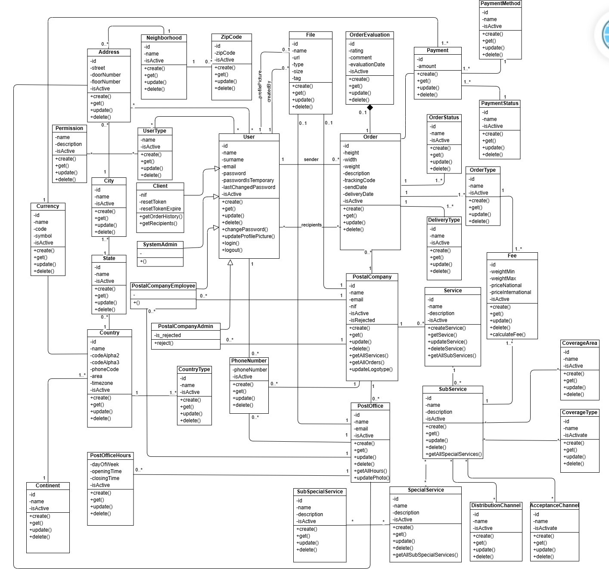
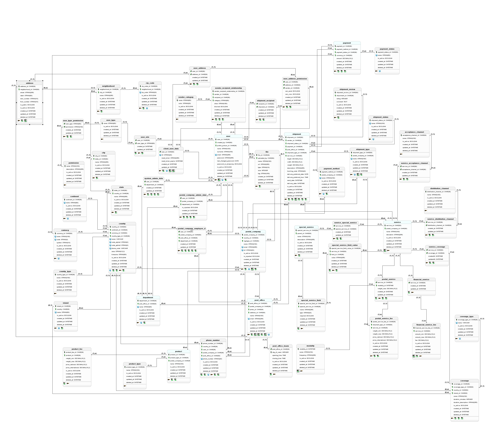

# Plataforma Logística

**Trabalho de Conclusão de Curso**

Este é um projeto desenvolvido como parte do Trabalho de Conclusão de Curso (TCC), que demonstra a execução de testes e a aplicação em modo de desenvolvimento.

## Diagramas

### Diagrama de Casos de Uso


### Diagrama de Classes


### Diagrama de Classes


### Diagrama Entidade-Relacionamento (DER)


## Requisitos

- Node.js (versão 14 ou superior)
- npm (versão 6 ou superior)

## Instalação

Clone o repositório e instale as dependências:

```bash
git clone <URL_DO_REPOSITORIO>
cd Plataforma_Logistica
npm install
```

## Executando a Aplicação

Para iniciar a aplicação em modo de desenvolvimento, execute:

```bash
npm run dev
```

## Executando os Testes

Para rodar os testes com Jest, execute:

```bash
npm test
```

## Estrutura do Projeto

- **src/**: Contém o código-fonte da aplicação.
- **test/**: Contém os arquivos de teste.
